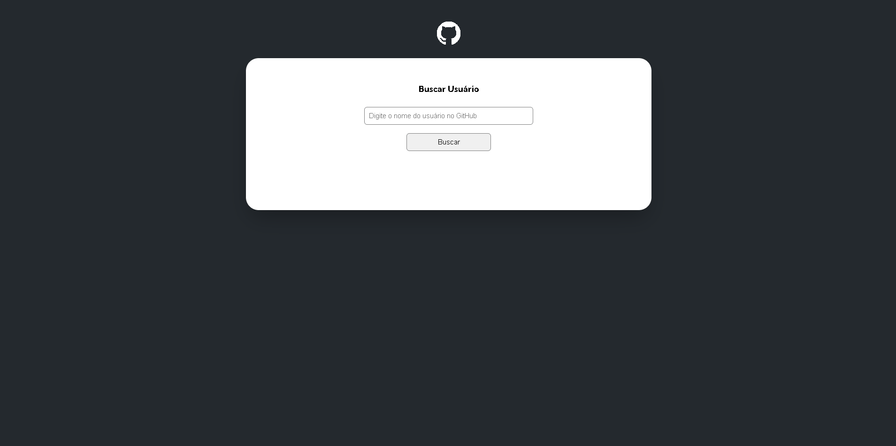

# Projeto Fetch com a API do GitHub

## Visão geral

Este é um desafio do módulo de front-end do curso DevQuest do canal Dev em Dobro. Neste desafio eu fiz uma página web funcional, que consegue pesquisar os usuários do GitHub  e suas inforamções com a API do  próprio GitHub e adicionar as seguintes features:

- Número de seguidores do usuário
- Número de pessoas que o usuário está seguindo
- Uma lista com os 10 últimos eventos do usuário no GitHub, mostrar o nome do repositório e a mensagem de cada evento 
- Quantidade de Forks nos repositórios
- Quantidade de estrelas do repositório
- Quantidade de watchers do repositório
- Mostrar a linguagem de programação do repositório

### Resultado

[Clique aqui para acessar a página web do desafio](https://guilherme-dangelo.github.io/Quest-API-GitHub/)

## Meu processo

### Feito com:

- Marcação semântica HTML
- CSS
- JavaScript
- API do GitHub

### O que eu aprendi:

Eu aprendi a usar melhor o conceito das APIs ao meu favor e também a importância de organizar melhor os arquivos e suas pastas com cada um com sua fução própria, assim melhorando a organização e otimizando o código.

## Autor

- Github - [Guilherme D'Angelo](https://github.com/Guilherme-DAngelo)
- Linkedin - [Guilherme D'Angelo](https://www.linkedin.com/in/guilherme-d-655705218/)
